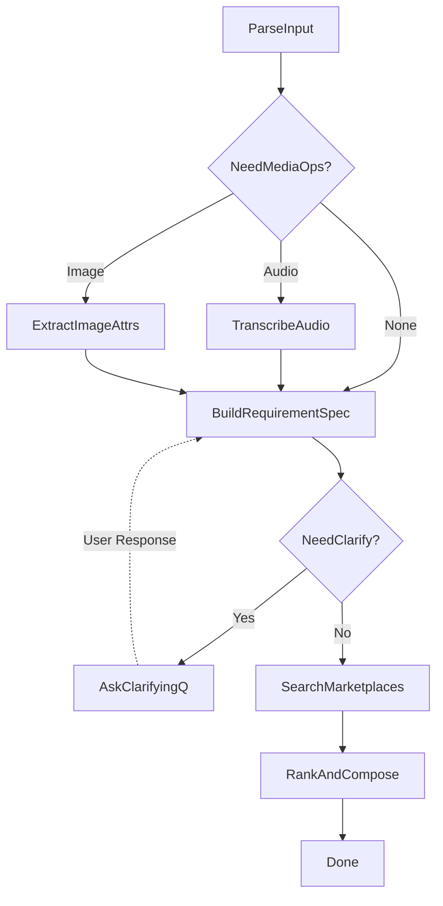

# Orchestrator Service

Real-time WebSocket-based orchestrator service for conversational product search, powered by AWS Bedrock (Claude 3), LangGraph state machine, and FastAPI.

## 🎯 Overview

The orchestrator service is the **central nervous system** of the TalknShop iOS chat application, providing:

- **WebSocket Communication**: Real-time bidirectional chat with token-by-token streaming
- **LangGraph Workflow**: 10-node state machine for buyer flow orchestration
- **AWS Bedrock Integration**: Claude 3 Sonnet for intelligent decision-making
- **State Persistence**: DynamoDB for session and conversation state
- **Service Orchestration**: Coordinates media-service and catalog-service
- **Production-Ready Infrastructure**: Comprehensive logging, error handling, retry logic

## 📊 Implementation Status

**85% Complete** - Core infrastructure and WebSocket architecture fully implemented.

See [IMPLEMENTATION_STATUS.md](./IMPLEMENTATION_STATUS.md) for detailed component breakdown.

## 🏗️ Architecture

### High-Level Flow
```
iOS App (URLSessionWebSocketTask)
  ↓
API Gateway (WebSocket API)
  ↓  
Orchestrator Service (ECS/Fargate)
  ├─→ AWS Bedrock (Claude 3)
  ├─→ Media Service (Transcription/Vision)
  ├─→ Catalog Service (Product Search)
  └─→ DynamoDB (State Persistence)
```

### WebSocket Communication
```
Client ─────→ ws://orchestrator/ws/chat
              │
              ├─ [Connected] → Session created
              │
              ├─ [Progress] → "Analyzing message..."
              │
              ├─ [Token] → Streaming LLM response
              │
              ├─ [Clarification] → "What's your budget?"
              │
              ├─ [Results] → Product search results
              │
              └─ [Done] → Workflow complete
```

### LangGraph Buyer Flow (10 Nodes)


## 🔌 API Endpoints

### HTTP Endpoints

#### Health & Monitoring
```bash
# Health check with AWS service status
GET /health

# Application metrics
GET /metrics

# Active connections (debug mode only)
GET /debug/connections
```

#### Session Management
```bash
# Get session information
GET /api/v1/sessions/{session_id}
```

### WebSocket Endpoint

#### Connection
```
WS /ws/chat?user_id=<user_id>&session_id=<optional>
```

#### Message Format

**Client → Server**:
```json
{
  "type": "message",
  "message": "I need a laptop under $1000",
  "media": [
    {
      "media_type": "image",
      "s3_key": "uploads/user123/laptop.jpg",
      "content_type": "image/jpeg",
      "size_bytes": 1024000
    }
  ]
}
```

**Server → Client Events**:
```json
// Connection established
{
  "type": "connected",
  "data": {
    "session_id": "sess_a1b2c3d4",
    "message": "Connected to TalknShop orchestrator"
  },
  "timestamp": "2025-10-24T10:00:00Z"
}

// Progress update
{
  "type": "progress",
  "data": {
    "step": "SearchMarketplaces",
    "message": "Searching Amazon, Walmart..."
  }
}

// LLM token streaming
{
  "type": "token",
  "data": {
    "content": "I found",
    "is_complete": false
  }
}

// Clarification question
{
  "type": "clarification",
  "data": {
    "question": "What's your budget range?",
    "suggestions": ["Under $500", "$500-$1000", "Over $1000"]
  }
}

// Search results
{
  "type": "results",
  "data": {
    "products": [...],
    "total_count": 45,
    "requirement_spec": {...}
  }
}

// Workflow complete
{
  "type": "done",
  "data": {
    "message": "Search completed"
  }
}
```

## 🚀 Quick Start

### Prerequisites
- Python 3.11+
- AWS Account with Bedrock access
- DynamoDB tables (or use local DynamoDB)

### Installation

1. **Clone and navigate**:
```bash
cd apps/orchestrator-service
```

2. **Create virtual environment**:
```bash
python3 -m venv .venv
source .venv/bin/activate  # On Windows: .venv\Scripts\activate
```

3. **Install dependencies**:
```bash
pip install -r requirements.txt
```

4. **Configure environment**:
```bash
cp env.example .env
# Edit .env with your AWS credentials
```

Minimum required `.env` variables:
```bash
AWS_REGION=us-west-2
DYNAMODB_TABLE_NAME=orchestrator-requests
BEDROCK_MODEL_ID=anthropic.claude-3-sonnet-20240229-v1:0
DEBUG=true
LOG_LEVEL=INFO
```

### Run Locally

```bash
# Development mode with auto-reload
uvicorn main:app --reload --host 0.0.0.0 --port 8000

# Or using Python
python main.py
```

Server starts at: `http://localhost:8000`
- Swagger UI: `http://localhost:8000/docs`
- Health: `http://localhost:8000/health`

### Test WebSocket Connection

#### Using JavaScript (Browser Console)
```javascript
const ws = new WebSocket('ws://localhost:8000/ws/chat?user_id=test_user');

ws.onopen = () => {
    console.log('✓ Connected');
    
    // Send a message
    ws.send(JSON.stringify({
        type: "message",
        message: "I need a laptop under $1000"
    }));
};

ws.onmessage = (event) => {
    const data = JSON.parse(event.data);
    console.log(`[${data.type}]`, data.data);
    
    // Handle token streaming
    if (data.type === 'token') {
        process.stdout.write(data.data.content);
    }
};

ws.onerror = (error) => console.error('WebSocket error:', error);
ws.onclose = () => console.log('✗ Disconnected');
```

#### Using Python (wscat alternative)
```python
import asyncio
import websockets
import json

async def test_websocket():
    uri = "ws://localhost:8000/ws/chat?user_id=test_user"
    
    async with websockets.connect(uri) as websocket:
        print("✓ Connected")
        
        # Send message
        await websocket.send(json.dumps({
            "type": "message",
            "message": "I need a laptop under $1000"
        }))
        
        # Receive responses
        async for message in websocket:
            data = json.loads(message)
            print(f"[{data['type']}]", data['data'])
            
            if data['type'] == 'done':
                break

asyncio.run(test_websocket())
```

#### Using cURL (for HTTP endpoints)
```bash
# Health check
curl http://localhost:8000/health | jq

# Metrics
curl http://localhost:8000/metrics | jq

# Session info (after WebSocket connection)
curl http://localhost:8000/api/v1/sessions/sess_abc123 | jq
```

## 📦 Dependencies

### Core Framework
- **FastAPI 0.115.0** - Web framework with WebSocket support
- **Uvicorn 0.30.6** - ASGI server
- **Pydantic 2.9.2** - Data validation
- **Websockets 12.0** - WebSocket protocol

### LangChain & AI
- **LangGraph 0.2.28** - State machine framework
- **LangChain 0.3.0** - LLM orchestration
- **LangChain-AWS 0.2.0** - Bedrock integration

### AWS & Storage
- **Boto3 1.35.20** - AWS SDK
- **Botocore 1.35.20** - AWS core library

### HTTP & Utilities
- **HTTPX 0.27.0** - Async HTTP client
- **Python-dotenv 1.0.1** - Environment management
- **Python-json-logger 2.0.7** - Structured logging

### Testing (Dev)
- **Pytest 8.3.3** - Testing framework
- **Pytest-asyncio 0.24.0** - Async test support

## Environment Variables

```bash
# Database
DYNAMODB_TABLE_NAME=orchestrator-requests
AWS_REGION=us-west-2

# Service URLs
MEDIA_SERVICE_URL=http://media-service:8001
CATALOG_SERVICE_URL=http://catalog-service:8002
RESPONSE_COMPOSER_URL=http://response-composer:8003

# AWS Configuration
AWS_ACCESS_KEY_ID=your_access_key
AWS_SECRET_ACCESS_KEY=your_secret_key

# Application
LOG_LEVEL=INFO
DEBUG=false
```

## Local Development

### Prerequisites
- Python 3.11+
- Docker and Docker Compose
- AWS CLI configured (for DynamoDB access)

### Setup

1. **Create virtual environment**:
   ```bash
   python3 -m venv .venv
   source .venv/bin/activate  # On Windows: .venv\Scripts\activate
   ```

2. **Install dependencies**:
   ```bash
   pip install -r requirements.txt
   ```

3. **Set environment variables**:
   ```bash
   cp .env.example .env
   # Edit .env with your configuration
   ```

4. **Run the service**:
   ```bash
   uvicorn main:app --reload --host 0.0.0.0 --port 8000
   ```

### Using Docker

```bash
# Build the image
docker build -t talknshop-orchestrator .

# Run the container
docker run -p 8000:8000 --env-file .env talknshop-orchestrator
```

### Using Docker Compose (Recommended)

From the monorepo root:
```bash
docker-compose up orchestrator-service
```

## Database Schema

### DynamoDB Table: `orchestrator-requests`

| Attribute | Type | Description |
|-----------|------|-------------|
| pk | String | Primary key (session_id) |
| sk | String | Sort key (timestamp or request_id) |
| user_id | String | User identifier |
| request_type | String | Type of request (search, chat, etc.) |
| status | String | Request status (pending, processing, completed, failed) |
| input_data | Map | Original request data |
| workflow_state | Map | Current workflow state |
| created_at | String | ISO timestamp |
| updated_at | String | ISO timestamp |

## Service Integration

### Media Service Integration
- **Purpose**: Handle audio transcription and image processing
- **Endpoints**: 
  - `POST /transcribe` - Audio transcription
  - `POST /extract-image-attributes` - Image analysis

### Catalog Service Integration
- **Purpose**: Search and retrieve product information
- **Endpoints**:
  - `POST /search` - Product search
  - `GET /products/{product_id}` - Product details

### Response Composer Integration
- **Purpose**: Format and rank responses
- **Endpoints**:
  - `POST /compose` - Compose final response
  - `POST /rank` - Rank search results

## Workflow States

1. **INITIAL**: Request received, parsing input
2. **MEDIA_PROCESSING**: Processing media files if present
3. **REQUIREMENT_BUILDING**: Building search requirements
4. **CLARIFICATION**: Waiting for user clarification
5. **SEARCHING**: Searching product catalogs
6. **RANKING**: Ranking and composing results
7. **COMPLETED**: Response ready
8. **FAILED**: Error occurred

## Error Handling

The service implements comprehensive error handling:

- **Validation Errors**: Invalid input data
- **Service Unavailable**: Downstream service failures
- **Timeout Errors**: Service response timeouts
- **Authentication Errors**: Invalid credentials
- **Rate Limiting**: Too many requests

## Monitoring and Logging

- **Health Checks**: Built-in health monitoring
- **Structured Logging**: JSON-formatted logs
- **Metrics**: Request/response timing, error rates
- **Tracing**: Distributed tracing for debugging

## Testing

```bash
# Run unit tests
pytest tests/

# Run integration tests
pytest tests/integration/

# Run with coverage
pytest --cov=app tests/
```

## Deployment

### AWS Deployment
1. **Build and push to ECR**:
   ```bash
   aws ecr get-login-password --region us-west-2 | docker login --username AWS --password-stdin <account>.dkr.ecr.us-west-2.amazonaws.com
   docker build -t talknshop-orchestrator .
   docker tag talknshop-orchestrator:latest <account>.dkr.ecr.us-west-2.amazonaws.com/talknshop-orchestrator:latest
   docker push <account>.dkr.ecr.us-west-2.amazonaws.com/talknshop-orchestrator:latest
   ```

2. **Deploy using CDK**:
   ```bash
   cd ../../infrastructure/cdk
   cdk deploy TalknShop-Orchestrator
   ```

### Environment-Specific Configuration

- **Development**: Local DynamoDB, mock services
- **Staging**: AWS DynamoDB, staging service URLs
- **Production**: AWS DynamoDB, production service URLs, enhanced monitoring

## API Documentation

Once the service is running, visit:
- **Swagger UI**: http://localhost:8000/docs
- **ReDoc**: http://localhost:8000/redoc

## Contributing

1. Follow the existing code style
2. Add tests for new features
3. Update documentation
4. Ensure all tests pass before submitting PR

## Troubleshooting

### Common Issues

1. **DynamoDB Connection Issues**:
   - Verify AWS credentials
   - Check AWS region configuration
   - Ensure table exists

2. **Service Communication Issues**:
   - Verify service URLs in environment variables
   - Check network connectivity
   - Review service logs

3. **Performance Issues**:
   - Monitor DynamoDB read/write capacity
   - Check service response times
   - Review memory usage

### Debug Mode

Enable debug logging:
```bash
export LOG_LEVEL=DEBUG
export DEBUG=true
```

## License

This project is part of the TalknShop application.
